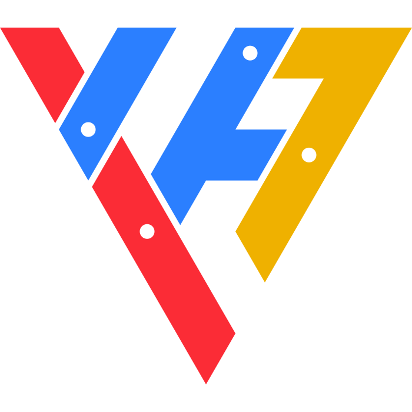
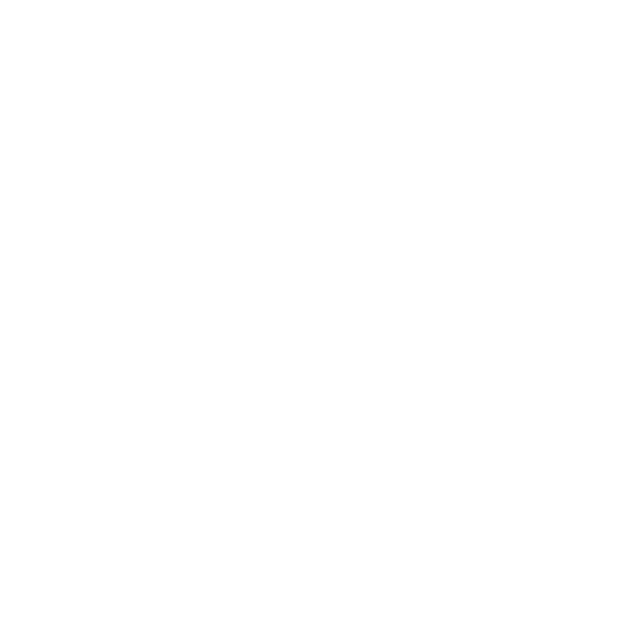

# yuarasino-logomark

新篠ゆうのロゴマーク



## 意匠

ロゴマークには以下のモチーフを含みます。

- キャラクターの髪飾りの赤青のクロスと青黄の三角
- YuArasinoの「Y」と「A」
- VTuberの「V」

髪飾りの三角や「Y」「A」「V」の字形から三角系のイメージが強かったので、
正三角形を敷き詰めたようなデザインにしています。

## ロゴマーク

ロゴマーク見本

| カラー版                                                                       | モノクロ版                                                               |
| ------------------------------------------------------------------------------ | ------------------------------------------------------------------------ |
|  |  |

※モノクロ版は白色で見えないので、クリックしてファイルを直接見てください。

## ファビコン

HTMLのheadタグに書くファビコン設定

```html
<link rel="icon" href="/favicon.ico" sizes="32x32" />
<link rel="icon" href="/icon.svg" type="image/svg+xml" />
<link rel="apple-touch-icon" href="/apple-touch-icon.png" />
```

## SVG生成

以下のコマンドを実行すると、`logomarks` ディレクトリにロゴマークが生成されます。

```bash
$ deno run main
```
